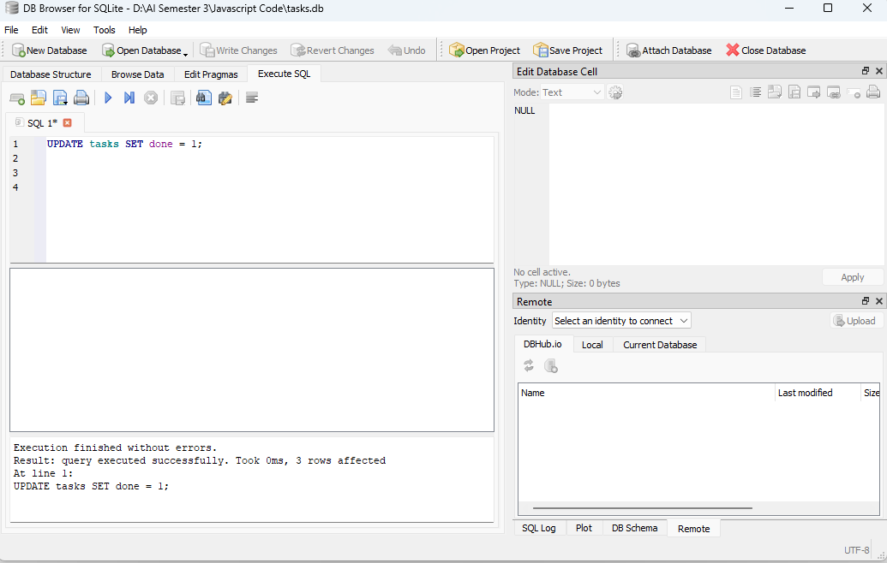

# Task API

A minimal CRUD API for managing tasks, built with Express.js. Tasks are stored in memory (no database yet — that's next in the FlyRank Backend AI Engineering track).

## Endpoints

| Method | Endpoint       | Description                  |
|--------|----------------|-------------------------------|
| GET    | `/`            | API info                     |
| GET    | `/status`      | Server status and time       |
| GET    | `/health`      | Health check                 |
| GET    | `/tasks`       | List all tasks               |
| GET    | `/tasks/:id`   | Get a single task by id      |
| POST   | `/tasks`       | Create a new task            |
| PUT    | `/tasks/:id`   | Update a task's title/done   |
| DELETE | `/tasks/:id`   | Delete a task                |

## How to run it

```bash
npm install
node server.js
```

Server starts at `http://localhost:3000`.

Interactive API docs (Swagger UI) are available at `http://localhost:3000/docs`.

## Example request

```bash
curl -i http://localhost:3000/tasks/1
```

Response:
```
HTTP/1.1 200 OK
Content-Type: application/json; charset=utf-8

{"id":1,"title":"Buy milk","done":false}
```

## Swagger UI


The full CRUD cycle (create, read, update, delete) can be tested directly from `/docs` using the "Try it out" button on each endpoint.

## Database

This project now uses SQLite instead of an in-memory array for storing tasks.

- **Why SQLite:** it requires no separate server or installation — the entire database lives in a single file, making it ideal for a small project like this. It's built into Node.js via the `node:sqlite` module, so no external native dependencies are needed.
- **Where the data lives:** `tasks.db`, in the project root. It's created automatically on first run if it doesn't exist.
- **How to start the project:**
```bash
  npm install
  node server.js
```
  The database and `tasks` table are created automatically, with 3 example tasks seeded only if the table is empty.

### Example SQL query

```sql
SELECT * FROM tasks WHERE done = 1;
```

Returns every task marked as completed.

### Database viewer



Verified that changes made directly in the database (via DB Browser for SQLite) are immediately reflected through the API, confirming the API and database share the same underlying data.