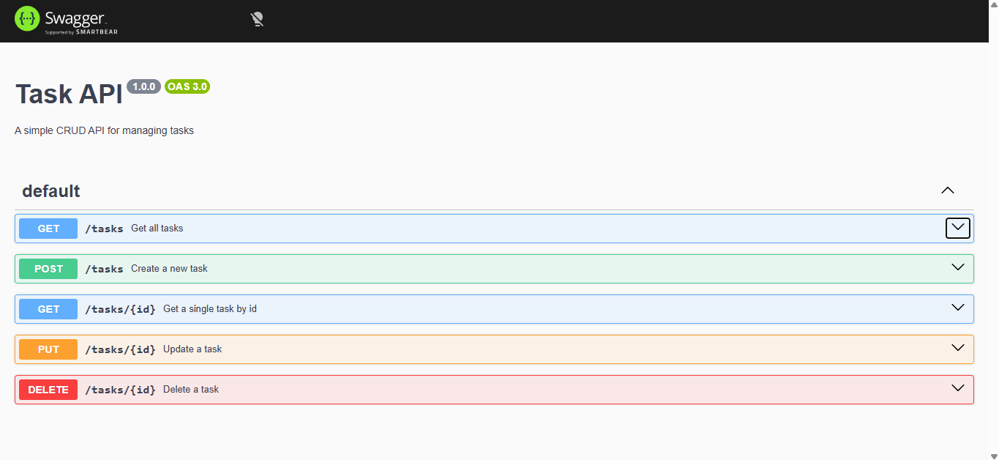

# Task API

A minimal CRUD API for managing tasks, built with Express.js. Tasks are stored in memory (no database yet — that's next in the FlyRank Backend AI Engineering track).

## Endpoints

| Method | Endpoint       | Description                  |
|--------|----------------|-------------------------------|
| GET    | `/`            | API info                     |
| GET    | `/status`      | Server status and time       |
| GET    | `/health`      | Health check                 |
| GET    | `/tasks`       | List all tasks               |
| GET    | `/tasks/:id`   | Get a single task by id      |
| POST   | `/tasks`       | Create a new task            |
| PUT    | `/tasks/:id`   | Update a task's title/done   |
| DELETE | `/tasks/:id`   | Delete a task                |

## How to run it

```bash
npm install
node server.js
```

Server starts at `http://localhost:3000`.

Interactive API docs (Swagger UI) are available at `http://localhost:3000/docs`.

## Example request

```bash
curl -i http://localhost:3000/tasks/1
```

Response:

HTTP/1.1 200 OK
Content-Type: application/json; charset=utf-8

{"id":1,"title":"Buy milk","done":false}

## Swagger UI



The full CRUD cycle (create, read, update, delete) can be tested directly from `/docs` using the "Try it out" button on each endpoint.